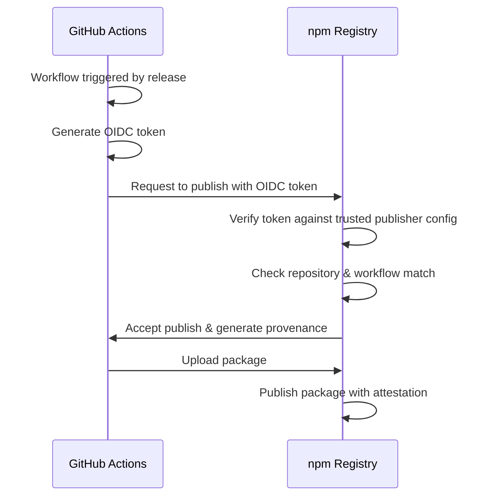

# 🔐 npm Trusted Publishing Setup Guide

**Trusted Publishing** is the most secure way to publish npm packages from GitHub Actions. It uses OpenID Connect (OIDC) tokens instead of long-lived credentials.

## ✨ Benefits

- 🔒 **No secrets to manage** - No npm tokens stored in GitHub
- 🛡️ **More secure** - Temporary tokens that expire automatically
- 📦 **Provenance included** - Automatic attestation of where your package was built
- 🎯 **Easier maintenance** - No token rotation needed

## 📋 Step-by-Step Setup

### Step 1: First-time publish (one-time only)

Before you can configure Trusted Publishing, the package must exist on npm. Do this **once** manually:

```bash
cd /Users/yanisberkane/Documents/visual-editor-package

# Make sure you're logged in
npm login

# Publish the first version
npm publish --access public
```

### Step 2: Configure Trusted Publishing on npm

1. **Go to your package on npm**:
   - Visit: https://www.npmjs.com/package/@deckedout/visual-editor
   
2. **Navigate to Settings**:
   - Click the "Settings" tab
   
3. **Find Publishing Access**:
   - Scroll down to "Publishing access" section
   - Click "Configure Trusted Publishers"
   
4. **Add GitHub as a Trusted Publisher**:
   Fill in these details:
   ```
   Provider:          GitHub Actions
   Repository owner:  EIP-DeckedOut-Orga
   Repository name:   eip-visual-editor-package
   Workflow filename: publish.yml
   Environment name:  (leave empty)
   ```
   
5. **Save the configuration**

### Step 3: Push the workflow to GitHub

```bash
cd /Users/yanisberkane/Documents/visual-editor-package

git add .github/workflows/publish.yml
git commit -m "Add Trusted Publishing workflow"
git push
```

### Step 4: Test it!

Create a release and watch it automatically publish:

```bash
# Bump version
npm version patch

# Push with tags
git push --follow-tags

# Create a GitHub release
# Go to: https://github.com/EIP-DeckedOut-Orga/eip-visual-editor-package/releases/new
# Or use GitHub CLI:
gh release create v1.0.2 --title "v1.0.2" --notes "Testing automated publishing"
```

## 🔍 How It Works



## ✅ Verification

After publishing, you can verify the provenance:

1. **On npm website**:
   - Go to your package page
   - Look for the "Provenance" badge
   
2. **Using npm CLI**:
   ```bash
   npm view @deckedout/visual-editor --json | jq .dist.attestations
   ```

3. **Check the publish log**:
   - Go to Actions tab on GitHub
   - Check the "Publish to npm" workflow run
   - You should see "npm notice Publishing with provenance"

## 🚨 Troubleshooting

### "403 Forbidden" error when publishing

**Cause**: Trusted Publisher not configured or configuration mismatch

**Solution**:
1. Double-check the repository owner, name, and workflow filename match exactly
2. Make sure you did the first manual publish to create the package
3. Verify the package exists: https://www.npmjs.com/package/@deckedout/visual-editor

### "Package not found" when configuring trusted publisher

**Cause**: Package doesn't exist on npm yet

**Solution**: Do the first publish manually (Step 1)

### Workflow fails with "needs permission to access this resource"

**Cause**: Missing `id-token: write` permission

**Solution**: Already included in the workflow! Check that you're using the latest version.

## 📚 Resources

- [npm Trusted Publishing Documentation](https://docs.npmjs.com/generating-provenance-statements)
- [GitHub OIDC Documentation](https://docs.github.com/en/actions/deployment/security-hardening-your-deployments/about-security-hardening-with-openid-connect)
- [npm Provenance Blog Post](https://github.blog/2023-04-19-introducing-npm-package-provenance/)

## 🎉 Benefits of Provenance

Your published packages will include:
- ✅ Build attestation (who built it, when, where)
- ✅ Source code link (Git commit SHA)
- ✅ Workflow reference (which GitHub Actions workflow)
- ✅ Tamper-proof signature

This helps users verify your package hasn't been modified since it was built!
